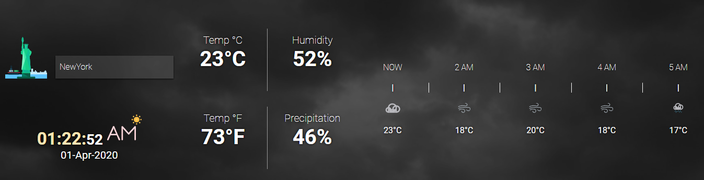
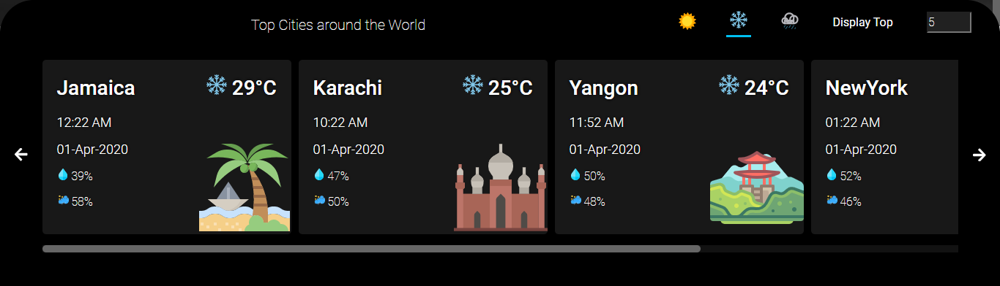
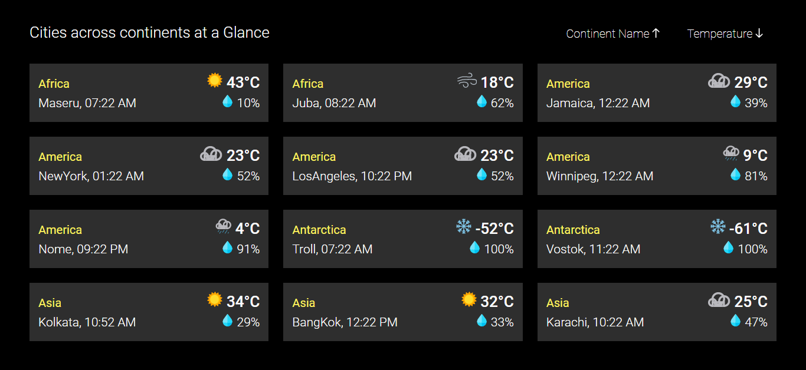
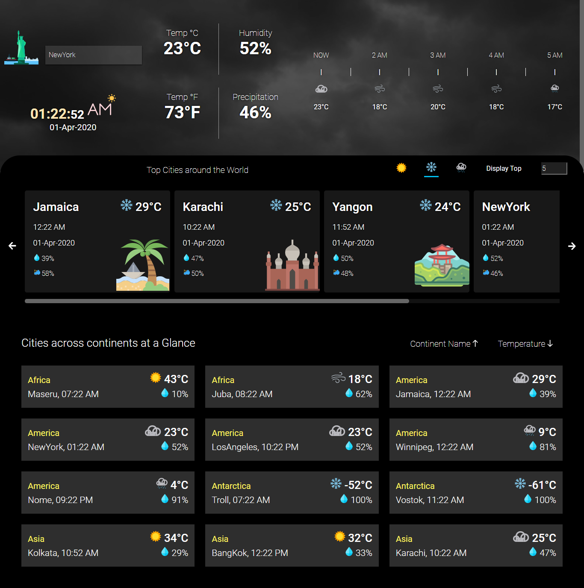

# Shridhar WEBTIPS Assignment

This is a part of Webtips Assignment.

# Weather App

Simple Weather App to display the Weather of different cities.

## Description

The Application consists of three sections in which the first one displays the weather and temperature of a selcted city for now and next few hours and second section displays the time of top cities in the world which are filtered by the temperature and the third section displays sortable grid of different cities in continents.

## Features

- #### Weather for Selected City

The realtime weather for the selected city from the dropdown will be displayed along with the current time at the city and the predicted weather for next five hours.

- #### User Preferred List of Cities

The List of Cities will be displayed based on the weather parameter(Sunny, Rainy or Snowy) preferred by the user. The Number of Cities to be Displayed can also be changed byb the user.

- #### Continent Wise List of Cities
  The List of Cities will be displayed based on the Continent Location. The Cities will be grouped based on Continent and they can be sorted by user preference and that subgroup can be sorted based on temperature.
  

## Website Screenshot

